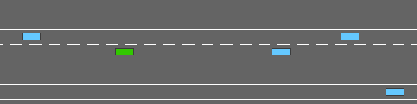
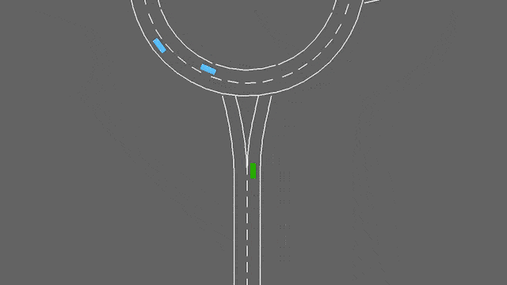

# MARL Benchmark on higway-env

## TO-DO
- [ ] Implement Log Recording / Model Saving
- [ ] Decentralized Algorithms
- [ ] Implement merge-v0 env
- [ ] Implement roundabout-v0 env
- [ ] Implement intersection-v0 env
- [ ] Implement racetrack-v0 env
- Implement some algorithm
## The Environments

highway-env by [eleurent](https://github.com/eleurent/highway-env)

The environments used:

**highway-v0**
<p align="center">
    <br/>
    <em>The highway-v0 environment.</em>
</p>

**intersection-v0**
<p align="center">
    <br/>
    <em>The intersection-v0 environment.</em>
</p>

**merge-v0**
<p align="center">
    <br/>
    <em>The merge-v0 environment.</em>
</p>

**roundabout-v0**
<p align="center">
    <br/>
    <em>The roundabout-v0 environment.</em>
</p>

**racetrack-v0**
<p align="center">
    <br/>
    <em>The racetrack-v0 environment.</em>
</p>

## The Agents

### IDQN
### IPPO

## Benchmark

Results are shared here

## Environment Setup

Clone and `cd` in the repository before running any of the commands:
```bash
git clone https://github.com/charbel-a-hC/ups-marl-benchmark.git
cd ups-marl-benchmark
```
You also need to install `python3` locally if you wish to run the notebook on a **local** environment. This automatically install `python3.6.9`. For Ubuntu:
```bash
sudo apt-get install python3.7 \
    python3-pip \
    python3-venv \
    python3-dev \
    python3-distutils
```
And you need to update your `pip`:
```bash
/usr/bin/python3 -m pip install --upgrade pip
```
### Docker
If you have docker installed:
```bash
docker build . -t ups-marl-benchmark
docker run -it --rm -v --runtime=nvidia ${PWD}:/ups-marl-benchmark ups-marl-benchmark
```
### Local Environment (Ubuntu-18.04) - Poetry

Simply run the make command in the repository:
```bash
make env
```
A virtual environment will be created after running the above command. In the same shell, run:
```bash
poetry shell
```
This will activate the environment and you start running any script from this stage.

### Local Environment - Conda
You can download Anaconda [here](https://docs.anaconda.com/anaconda/install/index.html).
After the download, open an anaconda navigator prompt if you're on windows and run the following commands:
```bash
conda env create -f environment.yml
conda activate ml
```
**Note**: If you're on Linux, you can open a normal terminal and run the following command before creating the environment:
```bash
conda activate base
```

### Google Colaboratory
You can open the notebook in Google Colab here: []()
